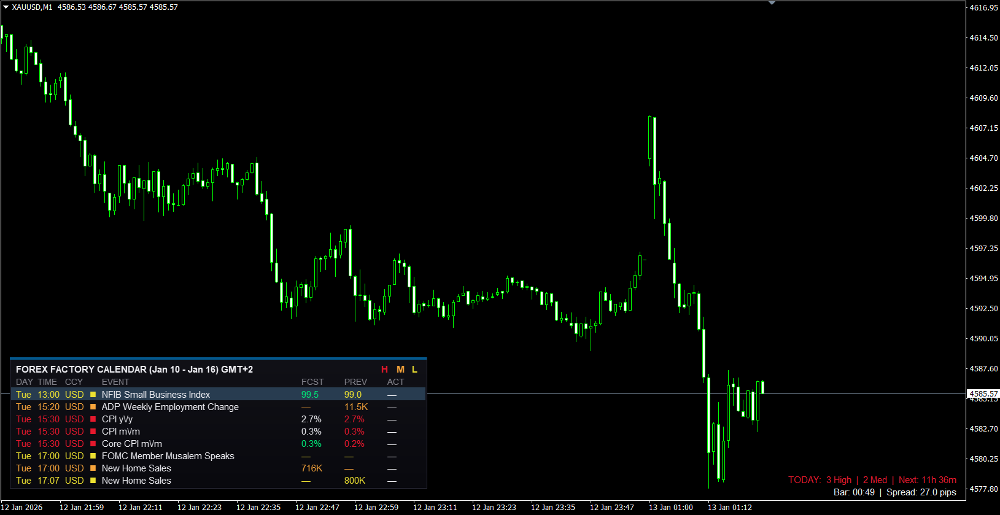

# 📅 Canvas Economic Calendar (FFC) v2.0

[](https://www.mql5.com/)
[](https://github.com/awran5/mql-trading-tools)
[](LICENSE)

A modern, **Canvas-based** Economic Calendar indicator for MetaTrader 4. This is a complete rewrite of the classic FFCal indicator, featuring a sleek UI, real-time filtering, and production-grade reliability.



---

## ✨ What's New in v2.0 (2025)

This version is a **complete rewrite** from the ground up, replacing the legacy 2016 codebase with modern architecture:

### 🎨 User Interface
- **Canvas-based rendering** - Smooth, flicker-free display using MQL4's CCanvas library
- **Draggable panel** - Position saved across sessions and timeframe changes
- **Real-time filter buttons** - Toggle High/Medium/Low impact events with a click
- **Modern dark theme** - Gradient background with carefully chosen colors
- **Responsive layout** - Adapts to chart resizing

### 📊 Features
| Feature | Description |
|---------|-------------|
| **Symbol Info Bar** | Displays today's event count, next event countdown, spread, and bar timer |
| **Historical Markers** | Visual markers on past candles where events occurred |
| **Vertical Lines** | Color-coded lines on the chart at event times |
| **Smart Countdown** | Days/hours/minutes format (e.g., "2d 5h", "45m") |
| **Actual Values** | Shows released data with color-coded comparison to forecast |

### 🔧 Technical Improvements
- **JSON API** - Faster parsing than legacy XML (data from [Fair Economy](https://nfs.faireconomy.media/))
- **Smart caching** - Auto-refresh on new week, 4-hour validity check
- **Input validation** - All parameters clamped to safe ranges
- **Timeout protection** - JSON parsing protected against hangs
- **Object pooling** - Reuses chart objects for better performance
- **Proper cleanup** - No orphaned objects on removal

---

## 📦 Installation

### Requirements
- MetaTrader 4 (Build 600+)
- Windows OS (uses `urlmon.dll` for downloads)
- Internet connection

### Steps

1. **Download** the indicator files
2. **Copy** `FFC.mq4` to:
   ```
   [MT4 Data Folder]\MQL4\Indicators\
   ```
3. **Enable DLL imports**:
   - Go to `Tools` → `Options` → `Expert Advisors`
   - Check ✅ `Allow DLL imports`
   - Click OK
4. **Restart MetaTrader 4**
5. **Attach** the indicator to any chart

> 💡 **Tip**: To find your MT4 Data Folder, go to `File` → `Open Data Folder` in MetaTrader.

---

## ⚙️ Configuration

### Event Filters
| Parameter | Default | Description |
|-----------|---------|-------------|
| `ReportActiveOnly` | `true` | Show only events for chart's currency pair |
| `IncludeHigh` | `true` | Include high-impact events |
| `IncludeMedium` | `true` | Include medium-impact events |
| `IncludeLow` | `true` | Include low-impact events |
| `IncludeSpeaks` | `true` | Include central bank speeches |
| `IncludeHolidays` | `false` | Include bank holidays |
| `FilterKeyword` | `""` | Show only events containing this word |
| `ExcludeKeyword` | `""` | Hide events containing this word |

### Display Settings
| Parameter | Default | Description |
|-----------|---------|-------------|
| `ShowPanel` | `true` | Show the main event panel |
| `ShowVerticalLines` | `true` | Draw vertical lines at event times |
| `ShowSymbolInfo` | `true` | Show the bottom info bar |
| `ShowHistoricalMarkers` | `true` | Mark past events on candles |
| `HideAfterMinutes` | `15` | Hide events after X minutes past |
| `ChartTimeOffset` | `0` | Manual timezone adjustment (hours) |

### Colors
All colors are fully customizable:
- `HighImpactColor` - Red events (default: `C'229,25,45'`)
- `MediumImpactColor` - Orange events (default: `C'247,164,59'`)
- `LowImpactColor` - Yellow events (default: `C'236,224,49'`)
- `PositiveColor` - Better than expected (default: `C'0,230,118'`)
- `NegativeColor` - Worse than expected (default: `C'255,82,82'`)

### Alerts
| Parameter | Default | Description |
|-----------|---------|-------------|
| `Alert1Minutes` | `30` | First alert (minutes before event) |
| `Alert2Minutes` | `5` | Second alert (minutes before event) |
| `EnablePopupAlert` | `false` | Show MT4 popup alerts |
| `EnableSoundAlert` | `true` | Play sound alerts |
| `EnablePushNotify` | `false` | Send push notifications |
| `EnableEmailAlert` | `false` | Send email alerts |

---

## 🔌 EA Integration (Buffers)

The indicator exposes two buffers for use in Expert Advisors:

```mql4
// Buffer 0: Minutes until next event (or EMPTY_VALUE if none)
double minutesUntil = iCustom(NULL, 0, "FFC", 0, 0);

// Buffer 1: Impact level (1=Low, 2=Medium, 3=High, 0=Holiday)
double impactLevel = iCustom(NULL, 0, "FFC", 1, 0);

// Example: Avoid trading 30 minutes before high-impact events
if(minutesUntil <= 30 && impactLevel == 3) {
   Print("High-impact event approaching, trading paused");
   return;
}
```

---

## 🖱️ Interactive Features

### Panel Dragging
Click and drag the panel header to reposition. Position is saved automatically.

### Filter Buttons
Click **H**, **M**, or **L** in the panel header to toggle impact filters in real-time:
- **H** (Red) - High impact events
- **M** (Orange) - Medium impact events  
- **L** (Yellow) - Low impact events

---

## 📁 File Structure

```
Canvas-Economic-Calendar/
├── FFC.mq4              # Main indicator source code
├── FFC.old.mq4          # Legacy v1.0 (2016) for reference
├── README.md            # This file
├── LICENSE              # MIT License
└── .gitignore           # Git ignore rules
```

---

## 🏗️ Architecture

### Data Flow
```
┌─────────────────┐     ┌──────────────┐     ┌─────────────┐
│  Fair Economy   │────▶│  JSON Cache  │────▶│  FFC Panel  │
│   JSON API      │     │  (4h valid)  │     │  (Canvas)   │
└─────────────────┘     └──────────────┘     └─────────────┘
                               │
                               ▼
                        ┌─────────────┐
                        │   Buffers   │
                        │  (for EAs)  │
                        └─────────────┘
```

### Key Components
- `CCanvas g_canvas` - Main rendering surface
- `CalendarEvent[]` - Structured event storage
- `GlobalVariables` - Persistent settings (position, filters)
- Object Pools - Reusable chart objects for markers/lines

---

## 📜 Version History

### v2.0 (January 2025)
- Complete rewrite with Canvas-based UI
- JSON API replacing XML
- Draggable panel with saved position
- Real-time filter buttons
- Historical event markers
- Enhanced Symbol Info bar
- Production hardening (validation, timeouts, pooling)

### v1.0 (August 2016)
- Original release by awran5
- XML-based data source
- Object-based rendering
- Basic panel with 4-corner positioning

---

## 🙏 Credits

This indicator builds upon the work of many contributors:

| Contributor | Contribution |
|-------------|--------------|
| **derkwehler** | Original FFCal core code (2006) |
| **deVries** | MT4 Build 600+ compatibility |
| **qFish** | Testing and improvements |
| **atstrader** | Active pair filtering |
| **traderathome** | Coordination and integration |
| **awran5** | v1.0 modifications (2016), v2.0 complete rewrite (2025) |

---

## 📄 License

This project is licensed under the MIT License - see the [LICENSE](LICENSE) file for details.

---

## 🤝 Contributing

Contributions are welcome! Please feel free to submit a Pull Request.

1. Fork the repository
2. Create your feature branch (`git checkout -b feature/AmazingFeature`)
3. Commit your changes (`git commit -m 'Add some AmazingFeature'`)
4. Push to the branch (`git push origin feature/AmazingFeature`)
5. Open a Pull Request

---

## 📮 Support

- **Issues**: [GitHub Issues](https://github.com/awran5/mql-trading-tools/issues)
- **Original Thread**: [ForexFactory Discussion](http://www.forexfactory.com/showthread.php?t=114792)
- **MQL5 Market**: [mql5.com/en/code/15931](https://www.mql5.com/en/code/15931)

---

<p align="center">
  Made with ❤️ for the MQL4 community
</p>
