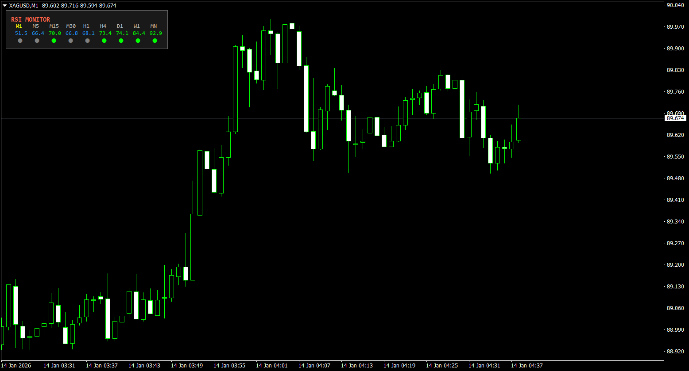
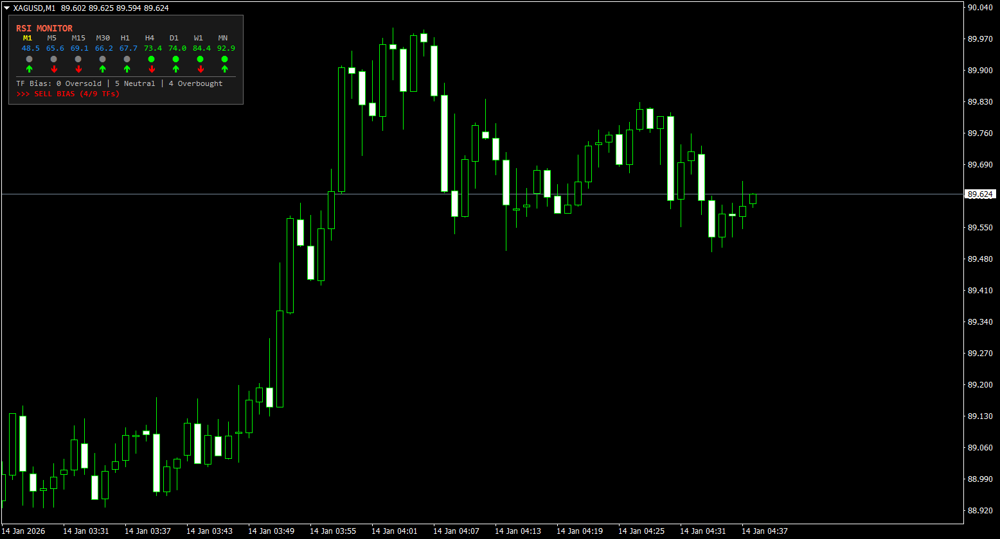
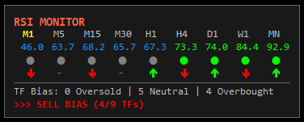

# RSI Monitor v2.0.0 (Institutional Edition)

A professional, high-performance Multi-Timeframe RSI panel for MetaTrader 4 (MQL4), engineered for high-frequency updates and deep market analysis.

## 🚀 Key Features

- **Multi-Timeframe Dashboard**: Monitor RSI states from M1 to MN1 in a single, compact panel.
- **Zero-Lag Calculation**: Optional Delagged RSI engine for faster response to volatile price movements.
- **Adaptive Trend Analysis**: Detects market momentum changes using percentage-based sensitivity.
- **Divergence Engine**: Built-in detection for Bullish and Bearish divergences with OB/OS zone qualification.
- **Confluence Scoring**: Aggregates bias across all timeframes to identify high-probability trading zones.
- **Institutional Alerts**: Smart alert system with per-timeframe cooldown and state escalation (e.g., OB → Extreme OB).

## 🛠 Performance Optimization

Engineered for the modern trader where every millisecond counts:
- **Multi-Tier Caching**: Reduces `iRSI` overhead by over 90% through intelligent value caching.
- **Instant Processing**: Calculations and alerts are processed on every tick, independent of the chart's timeframe.
- **Lightweight UI**: Fast-rendering objects using Wingdings symbols to minimize GPU/CPU impact.

## ⚙️ Configuration

- **RSI Period**: Standard or custom lookback period.
- **RSI Type**: Select between `Standard RSI` or `Zero-Lag RSI`.
- **Panel Style**: `Standard` for a compact view, or `Extended` for full trend/divergence data.
- **Alerts**: Support for Popup, Email, Push Notifications, and Sound files with configurable cooldowns.

## 📦 Installation

1. Open your MetaTrader 4 terminal.
2. Go to `File` -> `Open Data Folder`.
3. Navigate to `MQL4/Indicators`.
4. Copy `RSI_Monitor.mq4` into the folder.
5. Restart MT4 or refresh the Indicators list in the Navigator.

##  Legacy Version

The original v1.0.0 release (2015) is still available on the MQL5 CodeBase:
- [RSI Monitor v1.0.0 (Legacy)](https://www.mql5.com/en/code/15182)

## 📄 License

This indicator is part of the [mql-trading-tools](https://github.com/awran5/mql-trading-tools) repository and is licensed under the **MIT License**. See the root [LICENSE](../../../LICENSE) file for the full text.

---
**Developed by Awran5**
[GitHub](https://github.com/awran5) | [MQL5](https://www.mql5.com/en/users/awran5)
