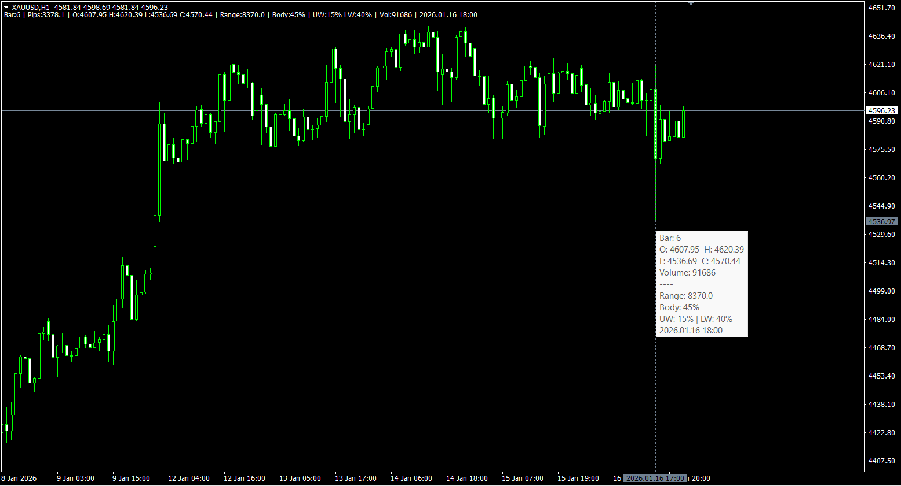
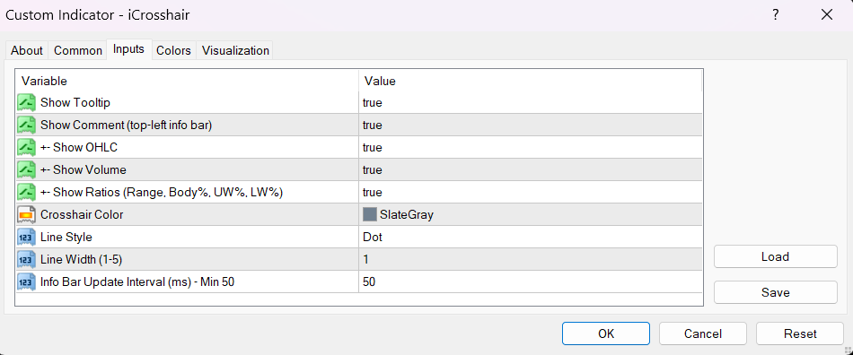

# iCrosshair v2.0 for MetaTrader 4

[](https://www.mql5.com/en/code/68324)
[](LICENSE)
[](https://www.metatrader4.com)

Interactive crosshair indicator with real-time candle analytics displayed in a single-line info bar.

> **Note:** Also available for [MT5](https://www.mql5.com/en/code/68324).





---

## What's New in v2.0

| Feature | v1.x (2015-2016) | v2.0 (2026) |
|---------|------------------|-------------|
| **Toggle Mode** | Click only | ✅ Click + **'T'** key |
| **Comment Format** | `bar / pips / price` | ✅ Full analytics line |
| **Range Display** | ❌ None | ✅ Total candle size |
| **Wick Display** | Absolute (pips) | ✅ Percentage of Range |
| **Body%** | ❌ None | ✅ Body as % of Range |
| **Close Time** | ❌ None | ✅ Full date & time |
| **Symbol Support** | Forex only | ✅ All asset classes |
| **Tooltip Fields** | All or nothing | ✅ Customizable |
| **Line Smoothness** | Basic | ✅ Two-tier updates |
| **Object Names** | Plain (`H Line`) | ✅ Namespaced (`iCH_`) |

---

## Features

### Interactive Crosshair
- Horizontal and vertical lines follow your mouse cursor in real-time
- **Smooth movement** - lines update immediately without lag
- Click lines or press **'T'** to toggle tracking mode
- Frozen lines can be used as Support/Resistance references

### Real-Time Info Bar
All candle data displayed in a **single-line info bar** at the top-left corner:

```
Bar:5 | Pips:12.3 | O:1.0850 H:1.0875 L:1.0820 C:1.0860 | Range:55 | Body:40% | UW:25% LW:35% | Vol:1234 | 2026.01.15 14:00
```

| Metric | Description |
|--------|-------------|
| **Bar** | Bar index from current (0 = current bar) |
| **Pips** | Distance from cursor to bar's close price |
| **O/H/L/C** | OHLC prices (compact format) |
| **Range** | Total candle size in pips/points |
| **Body%** | Body as percentage of Range |
| **UW%/LW%** | Upper/Lower Wick as percentage of Range |
| **Vol** | Tick volume for the bar |
| **Close Time** | Date and time of candle close |

### Universal Symbol Support
Automatic detection and adaptive display for all asset types:

| Asset Class | Examples | Display Unit |
|-------------|----------|--------------|
| **Forex** | EURUSD, GBPJPY | Pips |
| **Metals** | XAUUSD, XAGUSD | Points |
| **Indices** | SPX500, NAS100 | Points |
| **Crypto** | BTCUSD, ETHUSD | Points |

---

## Installation

1. Copy `iCrosshair.mq4` to your MT4 indicators folder:
   ```
   <MT4 Data Folder>/MQL4/Indicators/
   ```
2. Restart MetaTrader 4 or refresh the Navigator (`Ctrl+R`)
3. Drag the indicator onto any chart

**Finding your Data Folder:** In MT4, go to `File` → `Open Data Folder`

---

## Settings

### Display Options
| Parameter | Default | Description |
|-----------|---------|-------------|
| ShowTooltip | true | Show/hide tooltip on hover |
| ShowComment | true | Show/hide the info bar |
| Show_OHLC | true | Include O/H/L/C prices |
| Show_Volume | true | Include tick volume |
| Show_Ratios | true | Include Range, Body%, UW%, LW% |

### Visual Settings
| Parameter | Default | Description |
|-----------|---------|-------------|
| LineColor | SlateGray | Crosshair line color |
| LineStyle | Dot | Line style (Solid, Dash, Dot, etc.) |
| LineWidth | 1 | Line thickness (1-5) |

### Performance
| Parameter | Default | Description |
|-----------|---------|-------------|
| InfoUpdateInterval | 50ms | Info bar update frequency (min 50ms) |

> **Note:** Line movement is always immediate. Only tooltip/comment updates are debounced.

---

## Usage

### Toggle Tracking Mode
Two ways to freeze/unfreeze the crosshair:
- **Click** directly on the crosshair lines, OR
- Press **'T'** on your keyboard

When frozen, lines stay in place and can be used as visual S/R references.

### Measure Distance
1. Position the crosshair at point A
2. Press **'T'** to freeze
3. Click anywhere on the chart (point B)
4. Read the measurement: `Bars: X / Pips: X / Price: X`

---

## Links

- [Looking for MT5? Click here](https://www.mql5.com/en/code/68324)
- [Author Profile](https://www.mql5.com/en/users/awran5)

---

## License

Free for personal and commercial use.

---

## Changelog

### v2.0 (2026-01-17)
- Complete rewrite of original iCrosshair v1.x
- Added keyboard shortcut 'T' for toggle
- Added compact info bar with Range, Body%, UW%, LW%
- Added Close Time display
- Added universal symbol support (Forex, Metals, Indices, Crypto)
- Optimized with two-tier update strategy
- Namespaced object names to prevent conflicts

### v1.01 (2016)
- Added option to remove tooltip

### v1.00 (2015)
- Initial release

📋 **[Full Changelog](CHANGELOG.md)**
