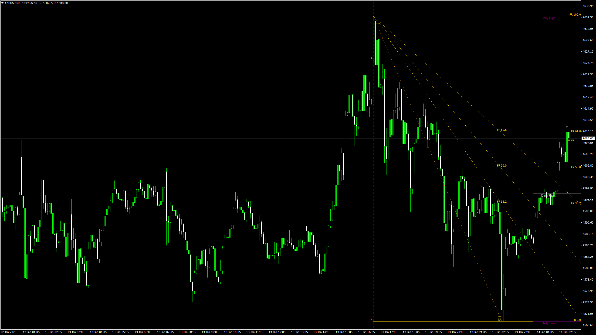

# iFibonacci v2.0


[](https://www.mql5.com/en/code/14393)

**Professional Fibonacci Tools Indicator with Non-Repainting Swing Detection**

Automatically draws Fibonacci Retracement, Arc, Fan, Time Zones, and Expansion based on detected swing points. Features a custom "Reverse-Scan" algorithm that **never repaints** - perfect for traders who need reliable anchor points.

---

## ✨ Features

### Core Fibonacci Tools
- **Retracement** - Standard Fibonacci retracement levels
- **Arc** - Auto-scaled Fibonacci arcs
- **Fan** - Fibonacci fan lines
- **Time Zones** - Fibonacci time zones projection
- **Expansion** - Fibonacci extension/expansion levels

### Swing Detection Engine
- **Non-Repainting** - Once a swing is confirmed, it never changes
- **Peak-Climbing** - Consecutive highs keep the HIGHER one
- **Right-Side Priority** - Fixes the common "equal highs" bug
- **Zero-Lag** - Uses direct memory access (CopyHigh/Low)

### Additional Features
- 📊 Daily/Weekly/Monthly High/Low lines with centered labels
- 🔔 Fibo Touch Alerts (Sound + Popup)
- ⏱️ Candle Timer display
- 💎 Pending Swing Visual (unconfirmed extremes)
- 🎨 Fully customizable colors, styles, and widths

---

## 📸 Screenshot



---

## 📥 Installation

**Download from MQL5 Code Base:** [https://www.mql5.com/en/code/14393](https://www.mql5.com/en/code/14393)

Or manually:

1. Download `iFibonacci.mq4`
2. Copy to: `[MT4 Data Folder]\MQL4\Indicators\`
3. Restart MetaTrader 4 or refresh the Navigator panel
4. Drag the indicator onto any chart

---

## ⚙️ Input Parameters

### Swing Detection
| Parameter | Default | Description |
|-----------|---------|-------------|
| AutoSwingDepth | true | Auto-adjust depth per timeframe |
| SwingDepth | 24 | Manual swing depth (if Auto=false) |
| SwingBackstep | 3 | Minimum bars between swings |
| MaxBars | 500 | Maximum bars to analyze |

### Fibonacci Tools
| Parameter | Default | Description |
|-----------|---------|-------------|
| ShowRetracement | true | Show Fibonacci Retracement |
| ShowArc | false | Show Fibonacci Arc |
| ShowFan | true | Show Fibonacci Fan |
| ShowTimeZones | false | Show Time Zones |
| ShowExpansion | false | Show Expansion |
| ExtraLevels | false | Enable extra levels (14.6%, 23.6%, etc.) |

### Price Levels
| Parameter | Default | Description |
|-----------|---------|-------------|
| ShowDaily | true | Show Daily High/Low |
| ShowWeekly | true | Show Weekly High/Low |
| ShowMonthly | true | Show Monthly High/Low |
| ShowPivot | true | Show Daily Pivot |

### Alerts
| Parameter | Default | Description |
|-----------|---------|-------------|
| AlertOnFiboTouch | false | Enable Fibo level alerts |
| AlertPopup | false | Show popup alerts |
| AlertSound | false | Play sound alerts |
| AlertTolerance | 0.2 | Alert tolerance (% of range) |

---

## 🔧 How It Works

### Reverse-Scan Swing Detection

Unlike traditional ZigZag indicators that repaint, iFibonacci uses a "Reverse-Scan" algorithm:

1. **Scans from newest to oldest** bars
2. **Confirms swings** only after `SwingDepth` bars have passed
3. **Peak-Climbing** ensures the highest/lowest extreme is used
4. **Never repaints** confirmed swing points

```
Traditional ZigZag: Repaints as new highs form ❌
iFibonacci: Waits for confirmation, stable anchors ✅
```

---

## 📋 Requirements

- MetaTrader 4 (Build 600+)
- Any currency pair or instrument
- Any timeframe (M1 to MN1)

---

## 📝 Changelog

See [CHANGELOG.md](CHANGELOG.md) for version history.

---

## 🙏 Credits

Original concept inspired by:
- JimDandy (jimdandyforex.com)
- WHRoeder (MQL5.com)
- RaptorUK (MQL5.com)
- deVries (MQL5.com)

---

## 📄 License

Copyright © 2015-2026, Awran5. All rights reserved.

---

## 🤝 Contributing

Issues and pull requests are welcome on [GitHub](https://github.com/awran5/iFibonacci).
