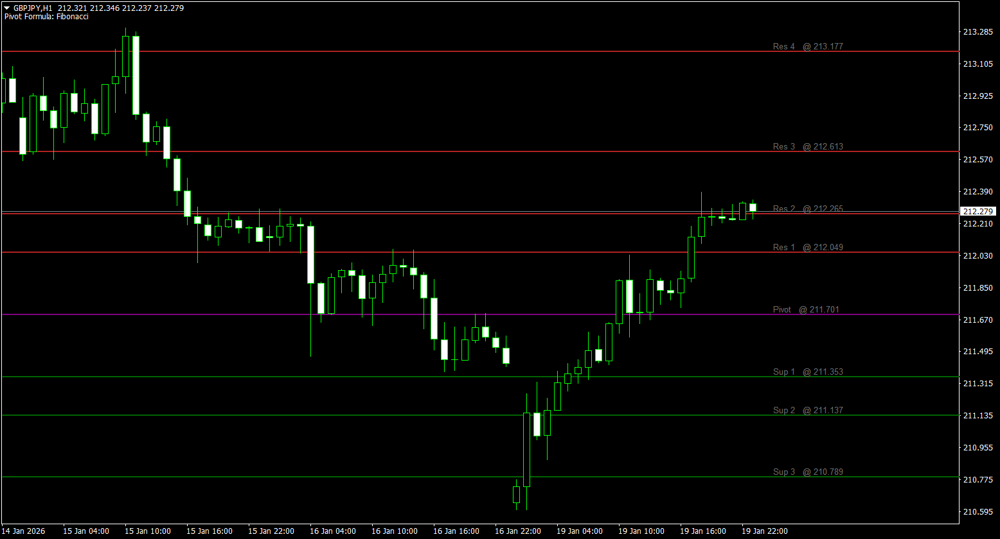
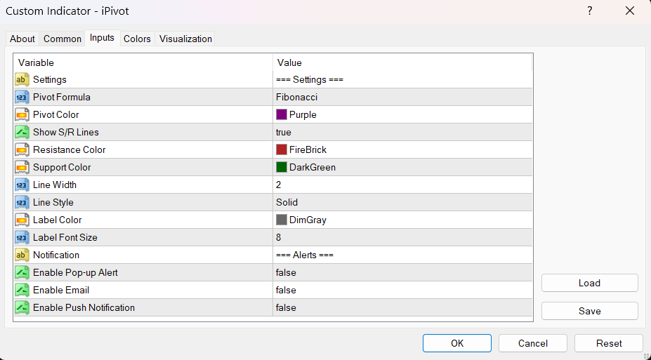

# iPivot - Institutional Grade Pivot Points (v2.00)

**A complete rewrite of the classic 2015 indicator, re-engineered for 2026 Institutional Standards.**

iPivot is a high-performance MetaTrader 4 indicator that calculates and displays daily support and resistance levels. Unlike standard retail indicators, iPivot v2.00 operates on an **Event-Driven Architecture**, ensuring **Zero-Lag** performance and minimal CPU footprint.

## 🚀 Key Features (v2.00)

### 1. Zero-Lag Engine
-   **Old Logic:** Re-calculated thousands of bars on every tick.
-   **New Logic:** Calculates levels **ONLY** when a new day begins.
-   **Result:** 0.00% CPU usage during trading hours.

### 2. Intelligent Visuals
-   **Persistent Objects:** Eliminates "screen flickering" by updating object coordinates instead of deleting/recreating them.
-   **Dynamic Labelling:** Labels (`Res 1`, `Sup 1`, etc.) automatically align to the right side of the chart as new bars form.
-   **Rich Info:** Labels now display the exact price (e.g., `Res 1   @ 1.23456`) for easier reading.

### 3. Professional Pivot Formulas
Support for 5 distinct institutional calculation methods:
-   **Standard:** The classic (H+L+C)/3 method.
-   **Fibonacci:** Standard Pivot with Fibonacci extensions (0.382, 0.618, 1.618).
-   **Camarilla:** The active trader's favorite for range fading.
-   **Woodie:** Weighted calculation giving priority to the Closing price.
-   **DeMark:** Focuses on the relationship between Open and Close to project the next day's range.

### 4. Robust Alert System
-   **Debounced Alerts:** Triggers **once per level, per bar**. No more spamming 50 alerts in 1 second when price hovers a line.
-   **Multi-Channel:** Supports Pop-up, Email, and **Mobile Push Notifications**.

## 🛠 Installation

1.  Download `iPivot.mq4`.
2.  Place it in your MT4 `Indicators` folder (`File -> Open Data Folder -> MQL4 -> Indicators`).
3.  Refresh your navigator or restart MT4.
4.  Apply to **any timeframe** (M1 to H4). The logic automatically locks to **D1 (Daily)** data.

## ⚙️ Settings

| Parameter | Default | Description |
| :--- | :--- | :--- |
| **PivotMethod** | Fibonacci | Choose formula (Standard, Fib, Camarilla, Woodie, DeMark) |
| **Show_SR** | true | Show Support/Resistance lines (S1-S4, R1-R4) |
| **Colors** | Purple/Red/Green | Customize colors for Pivot, Resistance, and Support |
| **UseAlert** | true | Enable Desktop Pop-up Alerts |
| **UsePush** | false | Enable Mobile Notifications (Metatrader App) |

## ⚠️ Compatibility
-   **Platform:** MetaTrader 4 (Build 600+)
-   **Strict Mode:** 100% Compliant (`#property strict`)
-   **Brokers:** Works on any broker (ECN/Standard). *Note: For best results, use a broker with New York Close charts (GMT+2/GMT+3) to align daily candles with institutional data.*

---
*Original Code by Awran5 (2015). Refactored by Awran5 and Google Gemini 3 Pro AI (2026).*
