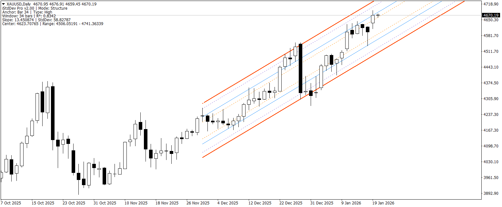
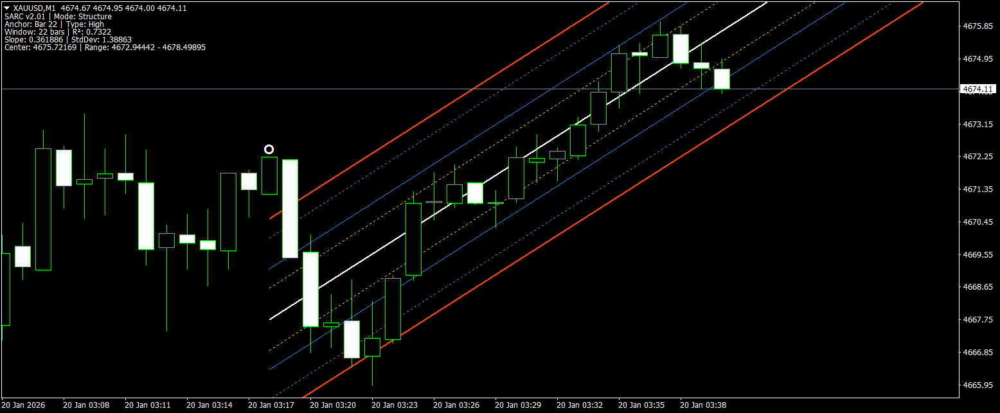
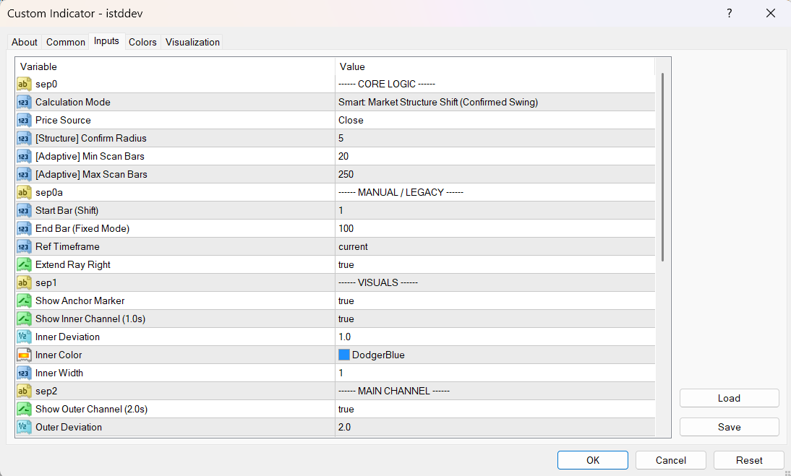
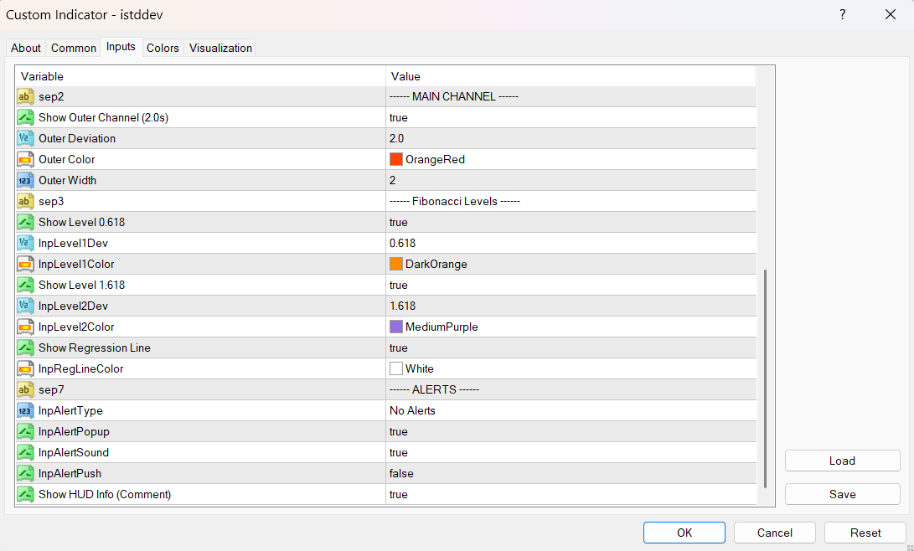

# iStdDev Pro v2.00

Advanced high-performance linear regression channel rewritten from the ground up for maximum precision, efficiency, and flexibility.

## Major Revitalization (v2.00)
This version represents a **complete rewrite from scratch**. The legacy calculation engine (v1.x) has been entirely replaced with a high-performance proprietary math library, moving from standard MT4 objects to raw statistical calculations for 100% determinism.

## Core Features

### 🎯 Three Intelligent Anchoring Modes
1. **Structure Mode** (Default)
   - Automatically detects technical Swing Highs/Lows using confirm radius.
   - Anchors to the most recent significant structural shift.
   
2. **Adaptive Mode**
   - Scans multiple lookback windows to find the "Best Fit" trend.
   - Mathematically optimizes for the highest **R² (Coefficient of Determination)**.
   
3. **Fixed Mode**
   - Provides consistent lookback for manual analysis or legacy compatibility.

### ⚡ Professional Performance
- **Single-Pass Calculation Engine**: Computes Regression, StdDev, and R² in one optimized loop (up to 60% faster than standard implementations).
- **Institutional Price Routing**: Choose between Close, Typical, Median, or Weighted price sources.
- **Smart Caching**: Zero redundant calculations for HUD updates and Alert monitoring.
- **Broker-Agnostic Scaling**: Automatic Pip/Point detection for 2, 3, 4, and 5-digit brokers.

### 🎨 Visual & Alert Systems
- **Multi-SD Channels**: Includes 1.0σ (Inner) and 2.0σ (Outer) bands.
- **Fibonacci Integration**: Built-in 0.618σ and 1.618σ levels for advanced harmonic targets.
- **Smart Anchor Markers**: Visual markers that distinguish between High and Low pivot points.
- **Comprehensive Alerts**: Touch/Break notifications for all bands with mobile (Push), Sound, and Popup support.
- **Real-Time HUD**: Professional chart commentary showing Slope, Trend Quality (R²), and precise price targets.

## Parameters

### Core Logic
| Parameter | Description |
|-----------|-------------|
| InpAnchorMode | Switch between Structure, Adaptive, or Fixed window logic. |
| InpPriceSource | Select input data (Close, Typical, Median, Weighted). |
| InpSwingStrength | Define sensitivity for Market Structure detection. |
| InpMaxBars | Max scan depth for optimization (default 250). |

### Visuals & Alerts
| Parameter | Description |
|-----------|-------------|
| InpShowInner | Toggle 1.0σ Central Band. |
| InpShowOuter | Toggle 2.0σ Primary Channel. |
| InpShowLevels | Toggle Fibonacci 0.618/1.618 targets. |
| InpAlertType | Select notification trigger (Touch/Break/Both). |
| InpShowInfo | Toggle the on-screen Institutional HUD. |

## Understanding R² (Trend Quality)
- **0.90 - 1.00**: Institutional-grade trend (Extremely reliable).
- **0.70 - 0.89**: Valid trading channel (Stable trend).
- **< 0.50**: Ranging/Choppy market (Low predictive value).

---
**Developed by:** awran5 (2026)
**Build:** v2.00 (Ground-up Rewrite)
**Compatibility:** MT4 build 600+
