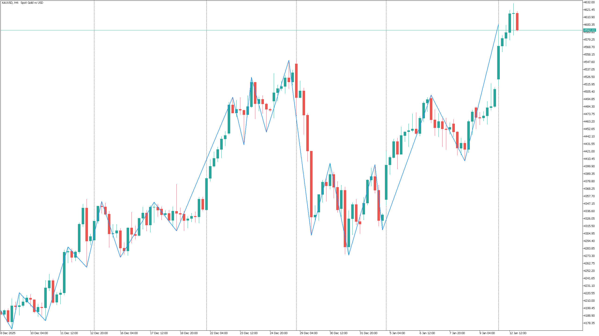

# ASZ - Adaptive Structure ZigZag


**Institutional-Grade Adaptive Swing Detection System for MetaTrader 5**

> Detects market structure using ATR-adaptive thresholds. Non-repainting on confirmed bars.



## ✨ Features

- **Hybrid Threshold System**: Fixed base × Adaptive modifier (±20%)
- **Three Modes**: Fixed, Adaptive, Hybrid (recommended)
- **Dynamic Fractal Detection**: 3-14 candles left-side search
- **Non-Repainting**: On confirmed bars only
- **ATR-Based Filter**: With O(1) cache optimization
- **State Machine Logic**: Clean alternation enforcement

## 📦 Installation

1. Copy `ASZ.mq5` to:
   ```
   [MT5 Data Folder]/MQL5/Indicators/
   ```
2. Restart MetaTrader 5 or refresh Navigator
3. Compile in MetaEditor (F7)
4. Drag to chart

## ⚙️ Parameters

### Threshold Settings

| Parameter | Default | Range | Description |
|-----------|---------|-------|-------------|
| ThresholdMode | Hybrid | - | Fixed/Adaptive/Hybrid |
| ATRPeriod | 14 | 1-500 | ATR calculation period |
| ATRAvgPeriod | 50 | 10-200 | ATR average for adaptation |
| BaseMultiplier | 1.0 | 0.5-3.0 | Base ATR multiplier |
| AdaptiveBoost | true | - | Enable ±20% modifier |

### Fractal Settings

| Parameter | Default | Description |
|-----------|---------|-------------|
| LeftMin | 3 | Minimum left-side candles |
| LeftMax | 14 | Maximum left-side candles |
| RightBars | 2 | Right-side confirmation |

### Display Settings

| Parameter | Default | Description |
|-----------|---------|-------------|
| LineColor | DodgerBlue | ZigZag line color |
| LineWidth | 2 | Line thickness |

## 🔧 Threshold Modes

### MODE_FIXED
```
Threshold = ATR × BaseMultiplier
```
Full manual control. Best for consistent market conditions.

### MODE_ADAPTIVE
```
Threshold = ATR × AdaptiveMultiplier(volatility)
```
Self-calibrating. Adjusts automatically to market volatility.

### MODE_HYBRID (Recommended)
```
Threshold = ATR × BaseMultiplier × AdaptiveModifier(±20%)
```
Best of both: user control + smart adaptation.

## ⚡ Performance

- **ATR Cache**: Single CopyBuffer call per tick (O(1) vs O(n))
- **Pre-calculated Averages**: No repeated sum calculations
- **Incremental Updates**: Only recalculates affected bars

## 📋 Non-Repainting Behavior

- ✅ Confirmed bars (excluding last N) never change
- ⚠️ Last swing may be replaced if better extreme appears
- 💡 Increase `RightBars` for stricter confirmation

## 🐛 Known Limitations

- Requires sufficient history for ATR calculations
- Performance depends on `ATRPeriod` and `ATRAvgPeriod` settings

## 📄 License

MIT License - See [LICENSE](LICENSE) file

## 📝 Changelog

See [CHANGELOG.md](CHANGELOG.md) for version history

---

*Formerly developed as "Adaptive ZigZag" during internal development.*
