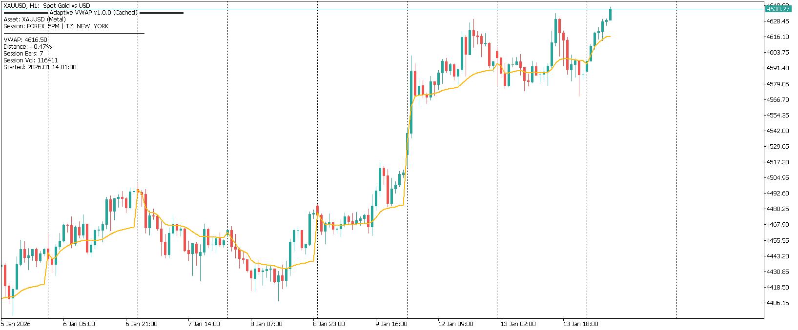
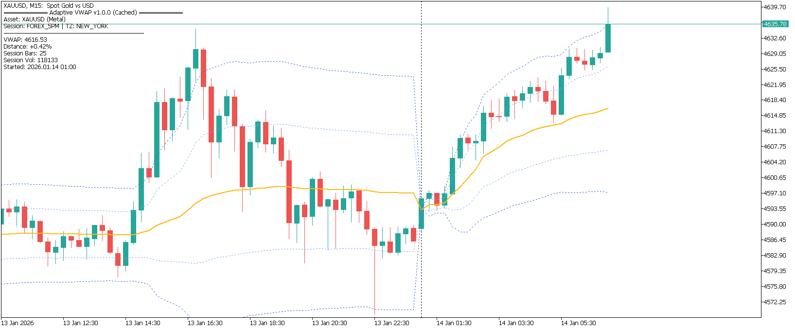

# Adaptive VWAP Institutional (MQL5)

Institutional-grade Volume Weighted Average Price (VWAP) indicator for MetaTrader 5, engineered for high-frequency trading (HFT) environments and professional asset management.

## 🚀 Key Features

*   **Multi-Stage Asset Intelligence**: Automatically detects Asset Classes (Crypto, Forex, Metals, Stocks, Indices) using a sophisticated 5-step verification process (Symbol Prefix/Suffix, Description Analysis, Digit Depth, Currency Mapping, and Exchange Calculation Modes).
*   **Institutional Timezone Engine**: DST-aware calculations using *Zeller's Congruence* for lifelong precision in New York, London, Tokyo, and Sydney sessions.
*   **Forex Standard Rollover**: Perfect 17:00 (5 PM) New York session reset - the gold standard for institutional Forex and Gold trading.
*   **Volatility-Adaptive Filtering**: Uses Median Volume sampling to neutralize "bad ticks" and institutional volume spikes that often distort retail VWAP indicators.
*   **Zero-Latency Persistence**: High-speed Disk Caching to preserve session state (PV/Vol/Stats) across terminal restarts, ensuring instant data availability and accurate historical rendering.
*   **Optimized Execution Loop**: Efficient $O(n)$ calculation with modularized helper functions and incremental per-tick updates, optimized for low-latency and VPS environments.
*   **Professional Analytics UI**: Real-time diagnostic panel displaying price distance, session volume, bar counts, and active server/target offsets.

## 🛠 Installation

1.  Download the `Adaptive_VWAP_Institutional.mq5` file.
2.  Open your MT5 Terminal, go to **File > Open Data Folder**.
3.  Navigate to `MQL5/Indicators/`.
4.  Copy the file into that folder (or a subfolder).
5.  Restart MT5 or right-click **Indicators** in the Navigator and select **Refresh**.

## ⚙️ Parameters

| Group | Parameter | Description |
| :--- | :--- | :--- |
| **VWAP Settings** | Session Reset Period | Daily, Weekly, Monthly, or Auto-Detected. |
| | Show Deviation Bands | Toggle visibility of $\pm\sigma$ bands. |
| **Timezone** | Reset Timezone | Choose the timezone context (NY is standard for FX). |
| | Server UTC Offset | Auto-detects server GMT offset with manual override. |
| **Data Quality** | Filter Spikes | Replaces volume spikes with median to maintain accuracy. |
| **Caching** | Enable Disk Cache | Persists calculations across sessions. |

## 👨‍💻 Developer
**Awran5**  
[GitHub Repository](https://github.com/awran5/mql-trading-tools)

## 📜 License
MIT License. Free for personal and commercial use.
