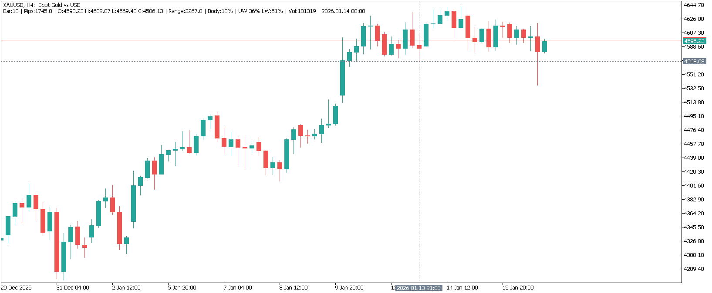
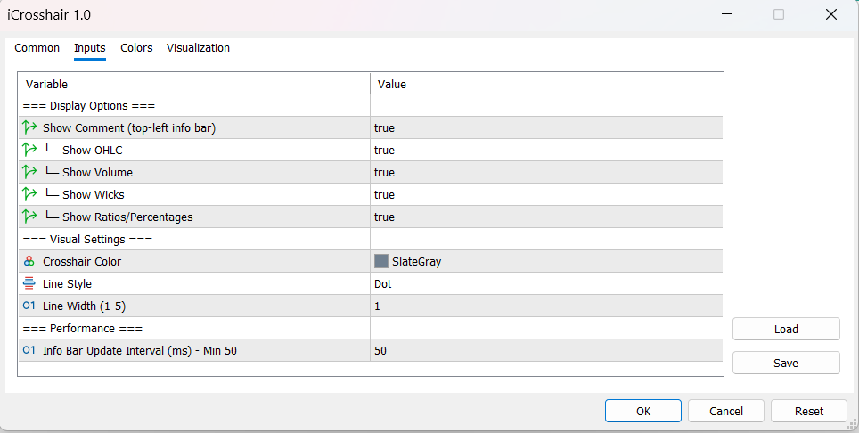

# iCrosshair v1.0 for MetaTrader 5

[](https://www.mql5.com/en/code)
[](LICENSE)
[](https://www.metatrader5.com)

Interactive crosshair indicator with real-time candle analytics displayed in a single-line info bar.

> **Note:** This is the first MT5 release, a complete rewrite of the original [iCrosshair.mq4](https://www.mql5.com/en/code/15515) (2015-2016).





---

## Features

### Interactive Crosshair
- Horizontal and vertical lines follow your mouse cursor in real-time
- **Smooth movement** - lines update immediately without lag
- Click lines or press **'T'** to toggle tracking mode
- Frozen lines can be used as Support/Resistance references

### Real-Time Info Bar
All candle data displayed in a **single-line info bar** at the top-left corner:

```
Bar:5 | Pips:12.3 | O:1.0850 H:1.0875 L:1.0820 C:1.0860 | Range:55 | Body:40% | UW:25% LW:35% | Vol:1234 | 2026.01.15 14:00
```

| Metric | Description |
|--------|-------------|
| **Bar** | Bar index from current (0 = current bar) |
| **Pips** | Distance from cursor to bar's close price |
| **O/H/L/C** | OHLC prices (compact format) |
| **Range** | Total candle size in pips/points |
| **Body%** | Body as percentage of Range |
| **UW%/LW%** | Upper/Lower Wick as percentage of Range |
| **Vol** | Tick volume for the bar |
| **Close Time** | Date and time of candle close |

### Universal Symbol Support
Automatic detection and adaptive display for all asset types:

| Asset Class | Examples | Display Unit |
|-------------|----------|--------------|
| **Forex** | EURUSD, GBPJPY | Pips |
| **Metals** | XAUUSD, XAGUSD | Points |
| **Indices** | SPX500, NAS100, DAX40 | Points |
| **Crypto** | BTCUSD, ETHUSD | Points |
| **Stocks** | AAPL, TSLA, MSFT | Points |

---

## Installation

1. Copy `iCrosshair.mq5` to your MT5 indicators folder:
   ```
   <MT5 Data Folder>/MQL5/Indicators/
   ```
2. Restart MetaTrader 5 or refresh the Navigator (`Ctrl+Shift+N`)
3. Drag the indicator onto any chart

**Finding your Data Folder:** In MT5, go to `File` → `Open Data Folder`

---

## Settings

### Display Options
| Parameter | Default | Description |
|-----------|---------|-------------|
| ShowComment | true | Show/hide the info bar |
| Show_OHLC | true | Include O/H/L/C prices |
| Show_Volume | true | Include tick volume |
| Show_Ratios | true | Include Range, Body%, UW%, LW% |

### Visual Settings
| Parameter | Default | Description |
|-----------|---------|-------------|
| LineColor | SlateGray | Crosshair line color |
| LineStyle | Dot | Line style (Solid, Dash, Dot, etc.) |
| LineWidth | 1 | Line thickness (1-5) |

### Performance
| Parameter | Default | Description |
|-----------|---------|-------------|
| InfoUpdateInterval | 50ms | Info bar update frequency (min 50ms) |

> **Note:** Line movement is always immediate regardless of InfoUpdateInterval. Only data calculations are debounced for performance.

---

## Usage

### Toggle Tracking Mode
Two ways to freeze/unfreeze the crosshair:
- **Click** directly on the crosshair lines, OR
- Press **'T'** on your keyboard

When frozen, lines stay in place and can be used as visual S/R references.

### Measure Distance
1. Position the crosshair at point A
2. Press **'T'** to freeze
3. Click anywhere on the chart (point B)
4. Read the measurement:
   ```
   Bars: 15  |  Pips: 45.7  |  Price: 1.08234
   ```

---

## Performance Optimizations

This indicator is designed for efficiency, even when running on multiple charts:

| Optimization | Benefit |
|--------------|---------|
| **Two-tier updates** | Lines move immediately; data updates at 20 FPS |
| **Smart caching** | Minimizes CopyRates API calls |
| **Sliding window** | Only loads 200 bars at a time |
| **Symbol detection cache** | Forex/non-Forex check runs once at startup |

**CPU Impact:** ~80% reduction compared to unconstrained mouse event processing.

---

## What's New in MT5 Version

Compared to the original MQL4 version (2015-2016):

| Feature | MQL4 | MT5 v1.0 |
|---------|------|----------|
| Keyboard shortcut | No | 'T' key |
| Single-line info bar | No | Yes |
| Customizable fields | No | 5 toggles |
| Body/Range % | No | Yes |
| Wick Ratio | No | Yes |
| Multi-asset support | Forex only | All symbols |
| Smooth line movement | Basic | Optimized |
| Error handling | Minimal | Comprehensive |

---

## Technical Details

### How It Works

```
Mouse Move Event
       │
       ▼
┌─────────────────────────────────┐
│  1. Convert screen coordinates  │
│  2. Update line positions       │ ← Immediate (every event)
│  3. ChartRedraw()               │
└─────────────────────────────────┘
       │
       ▼
   Debounce Check (50ms)
       │
       ▼
┌─────────────────────────────────┐
│  4. Get bar data (cached)       │
│  5. Calculate metrics           │ ← Throttled (20 FPS)
│  6. Update info bar             │
└─────────────────────────────────┘
```

### Array Indexing
- Uses `ArraySetAsSeries(rates, true)` for consistent indexing with `iBarShift()`
- `rates[0]` = newest bar in the sliding window
- `localBar = bar - startPos` correctly maps to the cached data

---

## Troubleshooting

| Issue | Solution |
|-------|----------|
| Lines not moving | Check if tracking is enabled (press 'T') |
| No info bar | Enable `ShowComment` in settings |
| Wrong data displayed | Ensure you're hovering over valid bars |
| High CPU usage | Increase `InfoUpdateInterval` (default 50ms is optimal) |

---

## Author

**Awran5**
- MQL5 Profile: [mql5.com/en/users/awran5](https://www.mql5.com/en/users/awran5)

---

## 📜 License

MIT License. Free for personal and commercial use.

---

## Links

- [Original MQL4 Version](https://www.mql5.com/en/code/15515) (2015-2016)
- [Author Profile](https://www.mql5.com/en/users/awran5)
- [MQL5 Code Base](https://www.mql5.com/en/code)

---

## Contributing

Found a bug or have a suggestion? Feel free to:
1. Open an issue on GitHub
2. Contact the author directly

---

## Changelog

### v1.0 (2026-01-17)
- Complete rewrite from MQL4 to MQL5
- Added keyboard shortcut 'T' for toggle
- Added compact info bar with Range, Body%, UW%, LW%
- Added Close Time display
- Added universal symbol support (Forex, Metals, Indices, Crypto)
- Optimized with smart caching and debounced rendering
- Added comprehensive error handling

📋 **[Full Changelog](CHANGELOG.md)**
